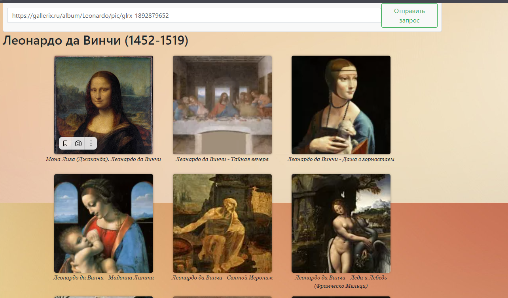

## JS Scripts
Создан файл JS без использования JQuery. Было применено Fetch и соответственно Promise.

## HTML5
Конец HTML-документа был украшен строкой, которая обновляет страницу и добавляет распаршенные картинки на страницу, включая имя художника. Некоторые изображения также имеют возможность перехода на сайт, с которого были взяты. Кроме того, к предыдущим изображениям была добавлена новая функция - при нажатии они открываются в оригинальном формате и могут быть скачаны.

### Пример валидного запроса 
Необходимо передавать картинку с большой картинкой и информацией о ней.
```
https://gallerix.ru/album/Leonardo/pic/glrx-1892879652
```
## Скриншоты 


### Промежуточные итоги
Получены навыки работы с JS и был ознакомлен с его особенностями.

