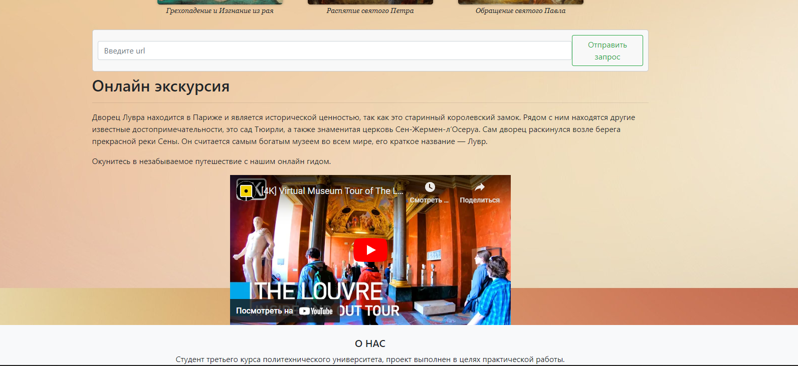
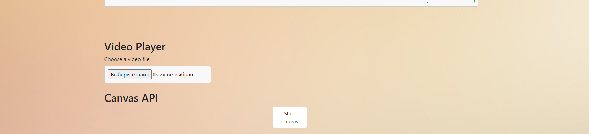

# JS Scripts
Создан файл JS без использования JQuery. Было применено Fetch и соответственно Promise.

## HTML5
Конец HTML-документа был украшен строкой, которая обновляет страницу и добавляет распаршенные картинки на страницу, включая имя художника. Некоторые изображения также имеют возможность перехода на сайт, с которого были взяты. Кроме того, к предыдущим изображениям была добавлена новая функция - при нажатии они открываются в оригинальном формате и могут быть скачаны.

### Пример валидного запроса 
Необходимо передавать картинку с большой картинкой и информацией о ней.
```
https://gallerix.ru/album/Leonardo/pic/glrx-1892879652
```
## Скриншоты 


### Промежуточные итоги
Получены навыки работы с JS и был ознакомлен с его особенностями.

# Video Tag & Canvas
## Video
Добавлен блок для добавления видео на веб-страницу с выводом проигрывателя после приложения видео. На изображении ниже показан блок input Video и пример приложенного видео. В целях обучения ввод ограничен mp4.




## Canvas
Добавлен блок для работы с Canvas. Для корректной работы необходимо выполнить следующие шаги:
1. Приложить видео.
2. Запустить Canvas.
3. Запустить видео.

Можно выполнить шаги в другом порядке, но при запуске Canvas нужно снова нажать кнопку StartCanvas, так как он начинает получать данные с момента, когда видео запущено. На изображении ниже показан блок Canvas.

